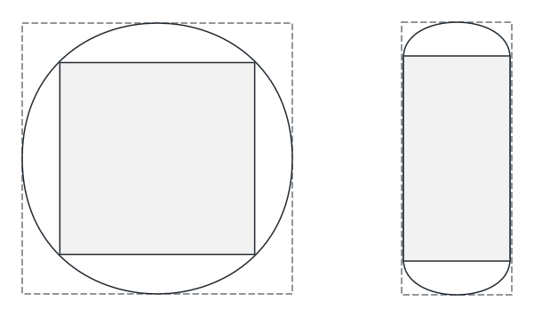

<!-- 源地址: https://iot.mi.com/vela/quickapp/zh/guide/design/multi-screens.html -->

# 多屏设计

## 小米智能穿戴设备

目前搭载vela系统的小米可穿戴设备主要为智能手表、手环产品。手表屏幕形状为圆形或矩形，手环产品为矩形和胶囊型屏幕为主。

已发布的vela穿戴设备数据参考：

设备类型 | 设备型号 | 屏幕形状 | 屏幕尺寸 | 分辨率 | PPI | DPR
---|---|---|---|---|---|---
手表 | Xiaomi Watch S1 Pro | 圆形 | 1.47英寸 | 480x480 | 326 | 2.0
手表 | Xiaomi Watch H1 | 圆形 | 1.43英寸 | 466x466 | 326 | 2.0
手表 | Xiaomi Watch S3 | 圆形 | 1.43英寸 | 466x466 | 326 | 2.0
手表 | Xiaomi Watch S4 sport | 圆形 | 1.43英寸 | 466x466 | 326 | 2.0
手表 | Xiaomi Watch S4 | 圆形 | 1.43英寸 | 466x466 | 326 | 2.0
手表 | REDMI Watch 5 | 矩形 | 2.07英寸 | 432x514 | 324 | 2.0
手环 | 小米手环8 Pro | 矩形 | 1.74英寸 | 336x480 | 336 | 2.1
手环 | 小米手环9 | 跑道型胶囊屏 | 1.62英寸 | 192x490 | 325 | 2.0
手环 | 小米手环9 Pro | 矩形 | 1.74英寸 | 336x480 | 336 | 2.1
手环 | 小米手环10 | 胶囊形 | 1.725英寸 | 212x520 | 326 | 2.0
手表 | Xiaomi Watch S5 | 圆形 | 1.485英寸 | 480x480 | 323 | 2.0 

## 设计建议

产品接入时可以根据应用场景及可适配的产品形态来做设计决策。若所属产品场景在手环、手表等多种屏幕形态都能很好的交互，建议出三类设计稿满足胶囊形、圆形、矩形屏的交互方案。

不同形状屏幕数据参考：

屏幕形状 | 圆屏 | 矩形屏 | 胶囊屏
---|---|---|---
长宽比范围 | W/H=1 | 0.5<=W/H<1 | 0.3<W/H<0.5
推荐长宽比例 | 1 | 0.7 | 0.39
推荐分辨率 | 466x466 | 336x480 | 192x490 

推荐设计三套UI交互适配三类主要屏幕，若圆屏矩形屏能够复用的话可以设计圆形、矩形屏采用一套，胶囊屏采用一套。

## 弧形屏幕适配安全区域

对于圆形以及胶囊形屏幕，弧形的屏幕边缘会带来一些显示问题，在UI设计时需要考虑屏幕的安全区域问题，将主体功能设计在屏幕安全区域内。

比如，文本显示或内容列表，需要考虑边缘位置的显示完整性和可交互性。

图示里灰色区域分别为圆屏、胶囊屏安全区。

