<!-- 源地址: https://iot.mi.com/vela/quickapp/zh/guide/start/use-ide.html -->

# 使用 AIoT-IDE 来开发 JS 应用

## 下载 AIoT-IDE

本应用支持 **macOS** 、**Windows** 及 **Ubuntu** 系统，请确保设备满足以下最低系统版本要求。

* * *

## 系统要求

操作系统 | 最低版本要求
---|---
macOS | 14（Sonoma）及以上
Windows | 10 或更高版本
Ubuntu | 20.04 LTS 或更高版本 

## 安装 AIoT-IDE

mac 版本下可能会遇到如下安装报错的问题:

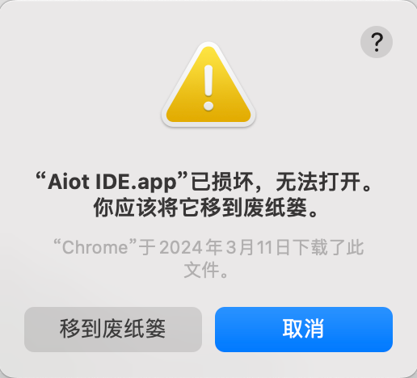

遇到此类问题，请按下面方法操作：

1.打开 shell 窗口，输入 ：`sudo xattr -r -d com.apple.quarantine`,如下图示例一。  
2.敲入空格 **再将应用程序拖入到窗口中** ，会得到下图示例二。  
3.点击回车，输入密码，再执行该程序即可。

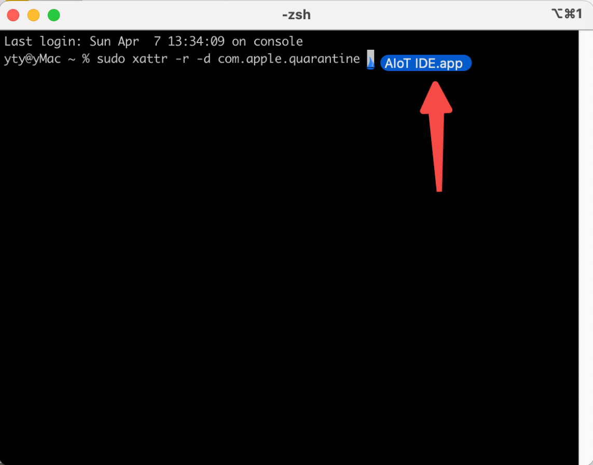

示例一

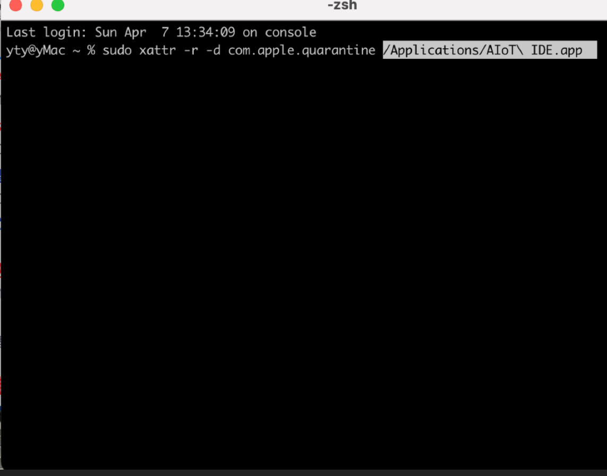

示例二

## 历史版本

历史版本地址：[点击查看 (opens new window)](<https://kpan.mioffice.cn/webfolder/ext/j6SfQsarf8I%40?n=0.18700074913007825>)  
密码：99E6

## 使用 AIoT-IDE

### 1\. 初始化 Vela 项目

  * 通过点击左上角 「文件」 > 「新建项目」 打开项目初始化图形界面
  * 点击卡片左侧边栏的 Vela，点击 「创建」
  * 选择一个项目模版，点击 「下一步」
  * 输入项目名称和项目保存路径后，点击「创建」，等待项目创建完成

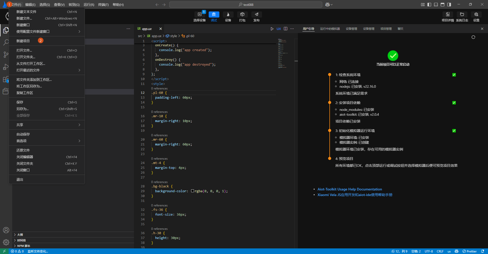

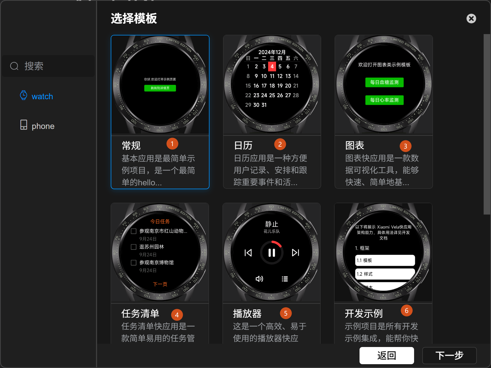

### 2\. 项目开发

支持依赖安装、运行、调试、重启、模拟器管理和打包项目等功能。  
打开 Vela 快应用项目后，AIoT-IDE 会弹出顶部的 banner 操作按钮栏以及右侧的开发向导页，可根据开发向导的指引安装相关的依赖。  
依赖安装完成后，可点击 banner 栏里的操作按钮实现对应的功能。

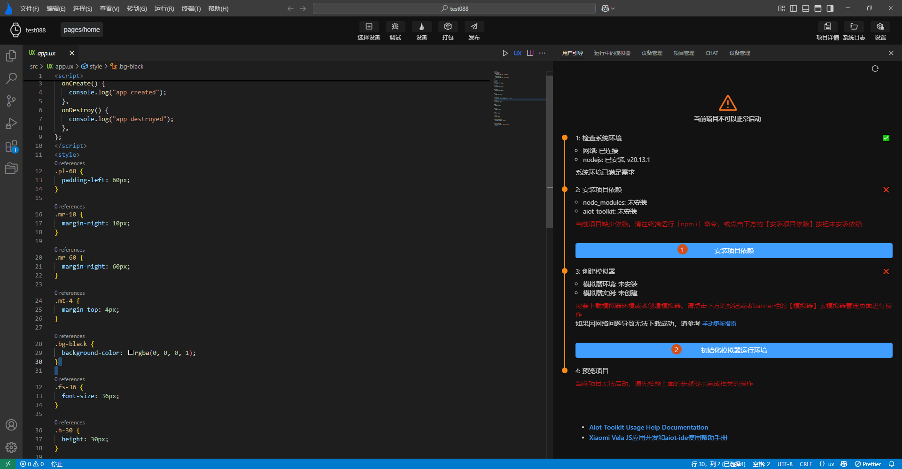

### 3\. 开发向导指引

打开 Vela 快应用项目，AIoT-IDE 右侧会弹出开发向导，用于指导开发。可以根据向导的提示完成对应的操作。

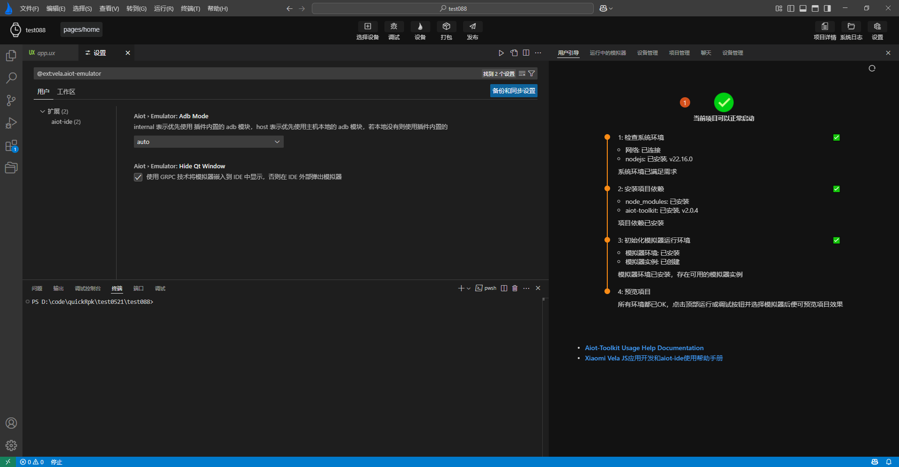

按向导提示遇到 npm i 下载 npm 包失败,可按如下方法解决：

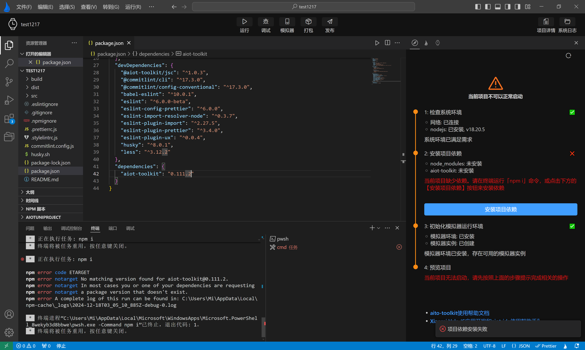

  * 检查当前项目根目录中是否有.npmrc 文件,如果没有则自己创建。

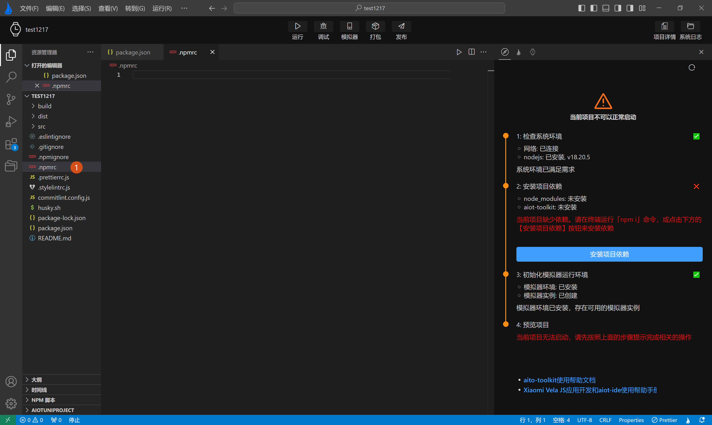

  * 打开.npmrc 文件,将下面内容复制到文件中

`registry="https://registry.npmmirror.com/"`

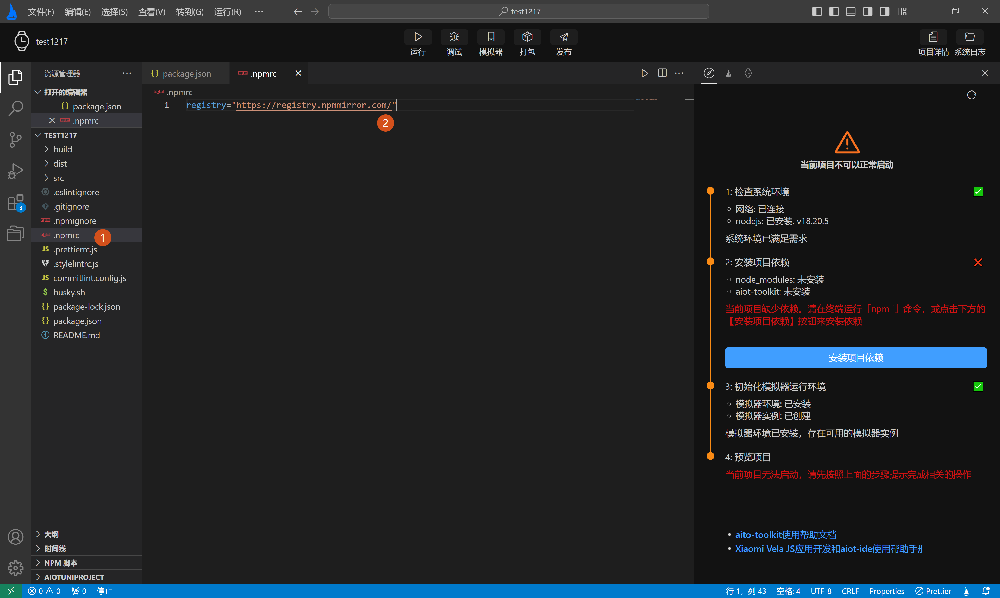

  * 打开终端,在终端重新运行 npm i

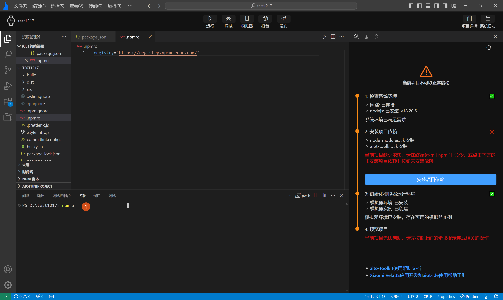

### 4\. 模拟环境管理

AIoT-IDE 支持自动初始化模拟器环境，创建、删除和列表展示模拟器，以便在运行/调试时可以选择不同的模拟器查看效果。

**模拟器环境说明**

如果缺少模拟器环境和模拟器实例，开发向导中会给出需相应的提示

  * 点击下方的「检查模拟器环境，创建模拟器实例」按钮，在弹出的模态窗口中选择 「自动安装」，插件会自动帮助安装模拟器相关的依赖
  * 在模拟器列表页，点击左上角的「创建」按钮去生成一个模拟器实例

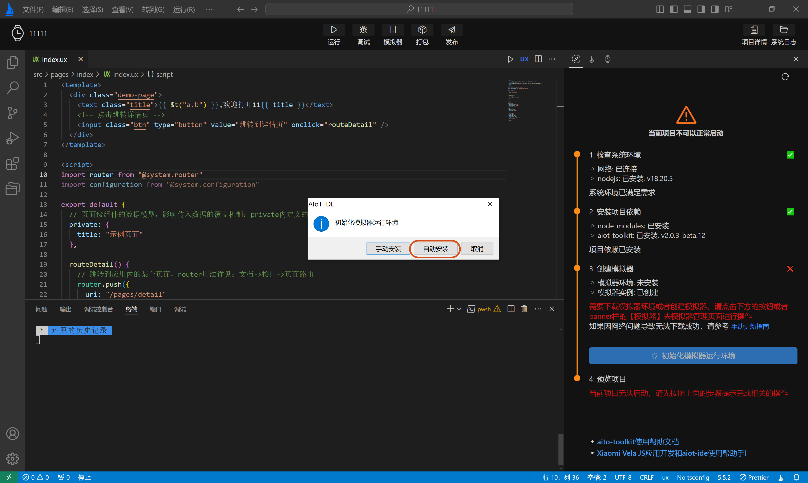

**模拟器操作说明**

  * 查看已创建的模拟器  
点击 banner 栏的「模拟器」按钮，进入模拟器列表页，这里可以看到已经创建的模拟器的详细信息

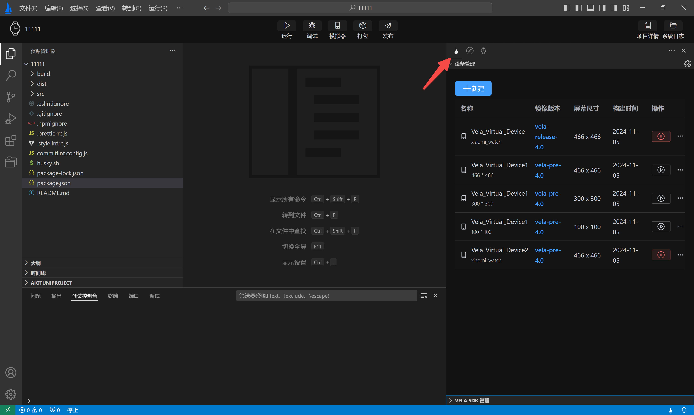

  * 创建一个新的模拟器 
    * 点击**设备管理** 左上角的**新建** 按钮，进入模拟器表单页
    * 在模拟器表单页，填写要创建的模拟器信息，点击「创建」按钮，插件首先会下载 Vela 镜像并完成创建

推荐使用 Vela 正式版（4.0）版本的镜像

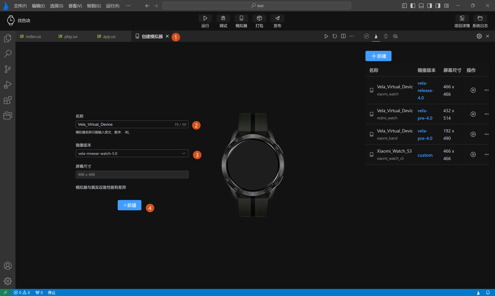

### 5\. 运行项目

运行时首先需要选择要在哪个模拟器上预览效果，选择后则会将当前打开的快应用在模拟器中启动并显示项目 UI。

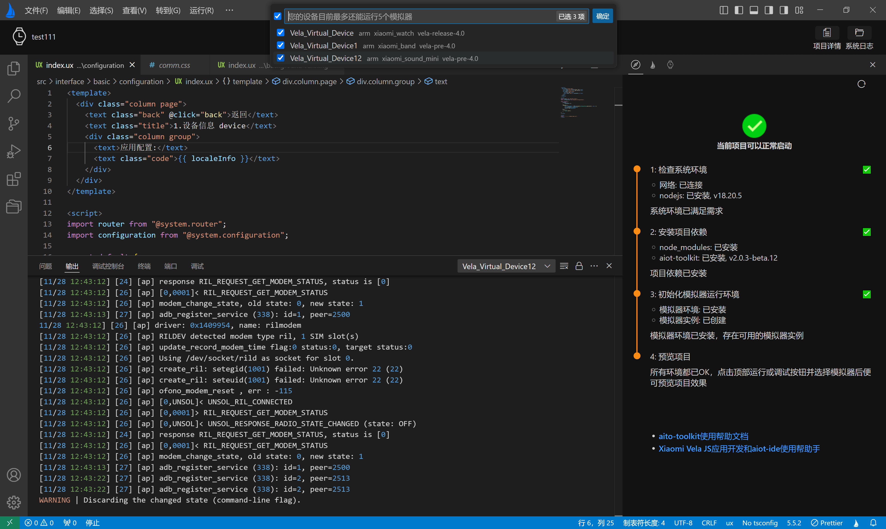

插件会过滤出`$HOME/.android/avd`这个目录下以“Vela”开头的所有模拟器，如果没有找到，AIoT-IDE 右下角会弹出提示，可点击「模拟器」按钮去进行创建。

### 6\. 调试项目

跟运行一样，调试时同样需要选择模拟器。  
快应用启动成功后，AIoT-IDE 底部会弹出调试面板，点击调试面板的 Tab 栏即可进行对应的操作，比如查看 DOM 树、查看 Console 以及断点调试。

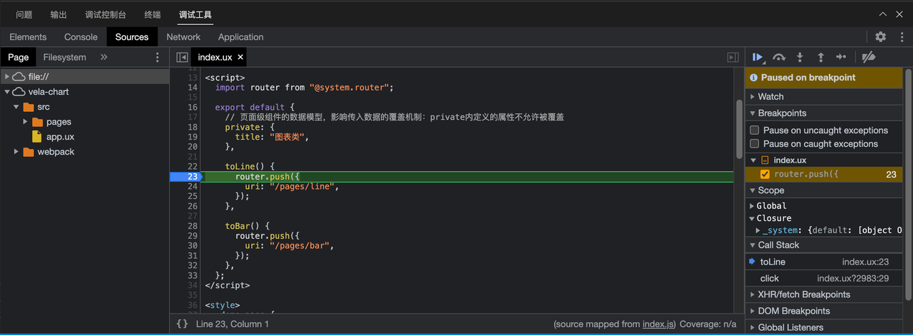

### 7\. 打包项目

**开发模式打包**  
开发完成后，可以点击 banner 栏的「打包」按钮来打包应用，默认会生成两个新的目录：dist、build；  
其中 dist 文件夹中会生成一个`.debug.rpk`文件，build 中会生成编译后的 js 文件。

**生产模式打包**

  * 打包前需要配置 signature private key ，生成签名文件

    * 自动生成：点击 banner 栏的「发布」按钮 > 填写相关信息 > 点击「完成」按钮，插件会在项目的 sign 目录下生成`private.pem`和`certificate.pem`两个文件。签名文件生成成功后，点击**顶部操作栏** 栏的「发布」按钮，打包生成的产物跟开发模式打包类似，但是 dist 文件夹中的 rpk 文件是 release 后缀。

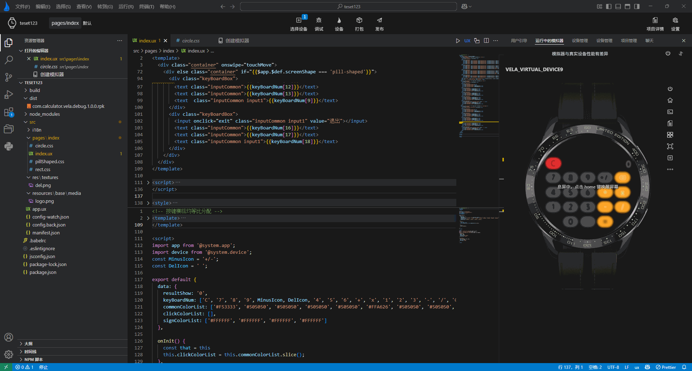

    * 自动生成需要系统环境安装了 openssl，windows 系统可能遇到 openssl 缺失的问题，下面是具体解决方法。

      * 安装 openssl 并配置系统环境变量，并重启电脑。重启成功后，在 AIoT-IDE 中打开终端，输入 openssl，如下图所示，则是安装成功。

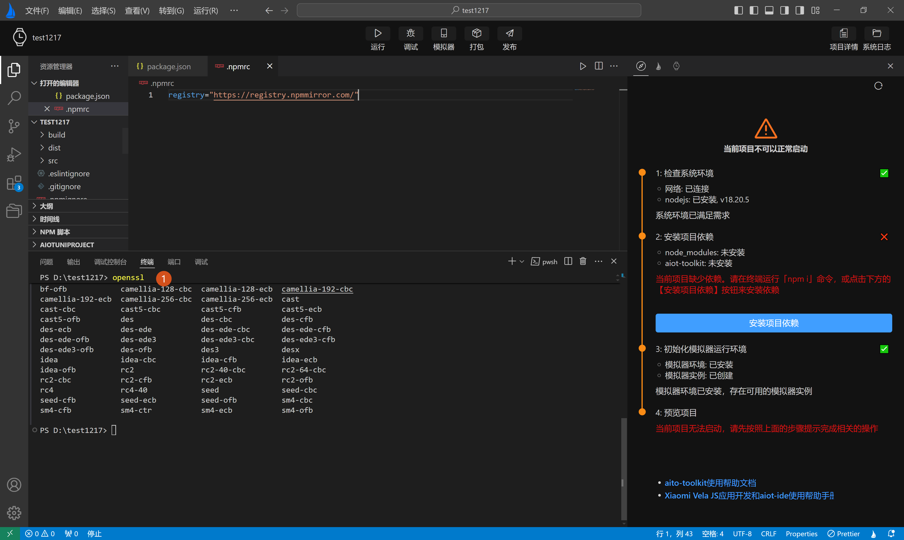

    * 手动生成：前提同样是系统环境安装了 openssl,然后打开终端运行以下命令生成签名文件，项目下新建 sign 目录，将生成的文件 private.pem 和 certificate.pem 放至该目录  
`openssl req -newkey rsa:2048 -nodes -keyout private.pem -x509 -days 3650 -out certificate.pem`
