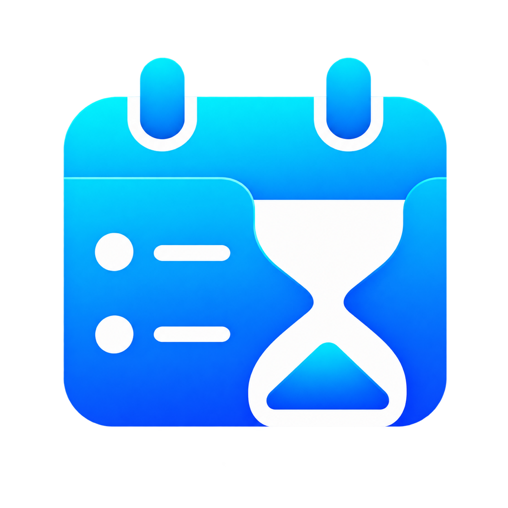

# CountDownTodo / Uni-Sync



[](LICENSE)


[](https://github.com/Junpgle/CountdownTodo/releases/latest)

CountDownTodo 是一个基于 Flutter 的跨平台效率工具，覆盖待办规划、倒数日、番茄钟、时间日志、课程表、屏幕时间复盘、团队协同和多端同步。

Countdown Todo is a Flutter productivity app combining todos, recurring todo series, habit tracking, countdowns, courses, focus sessions, plan blocks, collaboration, statistics, calendar integration and AI-assisted actions.

当前应用版本：`6.4.1`
文档更新时间：`2026-09-26`

## 支持平台

- **Android**：通知、桌面小组件（含“循环待办”）、HyperOS/HyperIsland 集成、屏幕使用时间统计、小米手环通信。
- **Windows**：桌面客户端，以及独立的灵动岛/悬浮窗 host（`lib/windows_island/`，Windows-only）。
- **macOS**：菜单栏（可关闭）、WidgetKit 小组件（含“循环待办”）、开机自启、深度链接、原生灵动岛/状态显示。
- **Web**：Flutter Web 客户端（Beta），通过 Cloudflare Zero Trust 访问 API；另有 React 网页介绍站 `webpage/web/`。
- **iOS**：Flutter host 工程存在，发布前需核实功能对齐。
- 配套项目：React 介绍页 `webpage/web/`、小米手环伴侣应用 `CountDownTodo-band/`。

## 主要功能

- **待办管理**：分组、提醒、循环待办（习惯另有独立打卡模型）、固定日程（独立 `fixed_schedules` 模型）、版本历史、冲突处理、回收站、AI 辅助操作。
- **规划块**：把已有待办安排到具体时间段，支持日视图创建、拖动改期、边缘调整、番茄钟绑定和统计，可写入系统日历。
- **番茄钟**：标签、暂停详情、运行状态持久化、规划块绑定、记录统计、WebSocket 跨端感知、云同步、专注备注。
- **习惯中心**：独立打卡模型（`lib/features/habits/`），连续天数与完成率统计、睡眠作息渐进训练、快捷打卡与小组件打卡。
- **个人记账**：离线优先的支出、收入、退款记录，分类/月度统计、账单筛选、月度总预算与分类预算、预算提醒、周期账单、快捷模板、CSV/JSON 备份和回收站恢复（`lib/features/finance/`）。
- **时间日志和时间线**：合并补录记录与番茄钟记录做效率分析；个人时间轴支持天/周/月/年维度。
- **课程表**：导入与解析（`lib/course_import/`）、共存模式、多学期切换、周/月视图、调休。
- **本地私密日记**：仅存本地的图文日记（`lib/features/journal/`）。
- **30 天挑战**：30 件小事清单挑战，支持云端模板目录和分享口令（`lib/features/thirty_day_challenge/`）。
- **团队协同**：团队管理、公告、消息中心、冲突收件箱、甘特图/热力图看板、共享链接查看。
- **全局搜索**：搜索待办、课程、倒数日、专注和时间记录，以及记账、日记、固定日程、规划块、习惯打卡、挑战、AI 对话和团队资料；结果可进入原生页面或详情页，并使用容器变换动画打开和返回。
- **AI 助手**：LLM 配置（含 NVIDIA NIM）、智能上下文注入、待办建议与操作、待确认记账草案及账单查询/修改/删除、图片识别待办和勋章 ML 推荐。
- **其他**：屏幕使用时间、首页壁纸、首页侧边栏配置（隐藏与排序）、未成年人模式（年龄权限矩阵）、液态玻璃视觉效果（可选开关与模式）、全局动态取色、个人专注报告、版本更新管理（含 Wi-Fi 自动下载更新包）。
- **本地 MCP 待办服务**：`mcp-server/` 提供 Node.js stdio MCP Server，供 Claude、VS Code、Cursor 等 Host 查询和操作本地待办，写入 `op_logs` 由 Uni-Sync 机制同步。

## 当前架构

- 主 Flutter 应用位于 `lib/`，平台壳位于 `android/`、`windows/`、`macos/`、`ios/`、`linux/`、`web/`。
- 高容量业务数据以 SQLite 为主存储（当前 schema v55）；`SharedPreferences` 保留设置、登录态、同步水位线、小缓存和兼容迁移。
- 主同步入口为 `StorageService.syncData()`，负责待办、分组、倒数日、时间日志、规划块、屏幕时间 payload 和能力门控的个人记账切片；番茄钟同步由 `PomodoroService` 单独处理（标签、记录、oplog 保护、漏传恢复水位线）。
- 后端同时保留 Alibaba Cloud 和 Cloudflare Worker。新后端能力优先修改 `CDT-server/debug/`（外部 checkout 的研发树）；`math-quiz-backend/` 保留兼容行为。
- Web 通过 Cloudflare Zero Trust 访问 `https://api-cdt.junpgle.me/`；Windows/Android 可直接访问 Alibaba Cloud HTTP 服务。
- WebSocket 用于番茄钟跨端感知和协同同步信号。
- Windows island / floating-window 是 Windows-only 逻辑，必须保持平台守卫，Android 不应导入或初始化。

## 仓库结构

```text
CountdownTodo/
├── lib/                    Flutter 主应用代码
│   ├── course_import/       课程导入处理器、解析器和 UI
│   ├── models/              AI action、聊天消息、勋章 ML 等扩展模型
│   ├── features/            自包含功能模块（习惯、私密日记、30 天挑战）
│   ├── screens/             页面层和功能页面
│   ├── services/            API、同步、数据库、番茄钟、AI、课程、时间线、通知、平台服务
│   │   └── storage/         StorageService 拆分的职责模块
│   ├── theme/               主题扩展（含液态玻璃主题应用）
│   ├── widgets/             可复用 UI 组件和首页区块
│   └── windows_island/      Windows-only 灵动岛/悬浮窗实现
├── mcp-server/              本地 MCP 待办服务（Node.js）
├── math-quiz-backend/       Cloudflare Worker 后端，保留兼容
├── CountDownTodo-band/      小米手环伴侣应用
├── webpage/web/             React 网页介绍站
├── docs/                    项目文档，按主题归档
├── android/ windows/ macos/ ios/ linux/ web/  平台壳
├── assets/ splash/ wallpaper/                 资源目录
├── scripts/                 构建和运行脚本
└── test/                    Flutter 测试
```

详见 [文档目录](docs/README.md)、[项目架构](docs/PROJECT_ARCHITECTURE.md) 和 [贡献指南](CONTRIBUTING.md)。

## 常用开发命令

在仓库根目录运行 Flutter 命令：

```bash
flutter pub get
flutter analyze
flutter test
flutter run -d <device>
dart format lib test
```

仓库脚本：

```bash
./scripts/build_macos.sh
./scripts/sync_macos_version.sh
./scripts/deploy_web_beta.sh

# 构建并归集 Android、macOS、Web 发布产物
./scripts/release_all.sh
```

产物会放在 `build/release-assets/v<版本>/`，其中包含 macOS ZIP、三个 Android APK 和 arm64-v8a 差分包，可直接全选上传。Web 会通过 `deploy_web_beta.sh` 构建并发布。

Cloudflare Worker 后端：

```bash
cd math-quiz-backend
npm install
npm run dev
npm test
```

手环应用：

```bash
cd CountDownTodo-band
npm run start
npm run build
npm run lint
```

MCP 待办服务：

```bash
cd mcp-server
npm install
COUNTDOWN_TODO_DATABASE="/absolute/path/uni_sync_<username>.db" npm run check
npm run lint
npm test
```

## 文档入口

- [文档目录](docs/README.md)
- [项目架构](docs/PROJECT_ARCHITECTURE.md)
- [待办与日程语义](docs/features/todo-semantics.md)
- [规划块说明](docs/features/plan-blocks.md)
- [习惯中心设计](docs/habits.md)
- [AI 待办助手](docs/ai/todo-agent.md)
- [冲突与同步逻辑](docs/sync/conflict-logic.md)
- [勋章推荐](docs/features/medal-recommendation.md)
- [全局搜索](docs/features/global-search.md)
- [macOS 支持](docs/features/mac-support.md)
- [人机验证](docs/features/captcha-verification.md)
- [版本管理修复报告](docs/reports/version-management-fix.md)
- [冲突修复排查报告](docs/reports/conflict-resolution-efforts.md)
- [lib 总览](lib/README.md)
- [services 总览](lib/services/README.md)
- [screens 总览](lib/screens/README.md)
- [widgets 总览](lib/widgets/README.md)
- [Windows 灵动岛总览](lib/windows_island/README.md)
- [MCP 服务说明](mcp-server/README.md)

## 关键规则

- 新后端能力优先修改 `CDT-server/debug/`；不要修改生产代码 `CDT-server/math_quiz_backend/`，除非任务明确要求。
- 保留 Cloudflare Worker 兼容路径，除非任务明确要求迁移或删除。
- Windows island / floating-window 逻辑必须保持 Windows-only。
- 不要提交 secrets、签名密钥、凭据、keystore、证书或私有部署配置；只使用开发后端配置。
